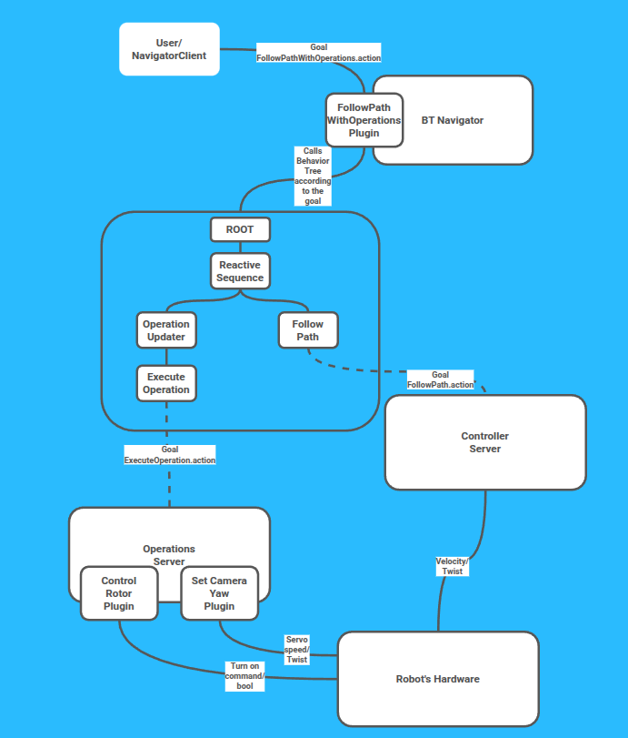

# Writing Custom Services in ROS2 Navigation2

- [The Problem: Operations During Navigation](#the-problem-operations-during-navigation)
- [Designing the Solution](#designing-the-solution)
  - [Why Behavior Trees?](#why-behavior-trees)
  - [One BT Node Per Action — and Why That's Not Enough](#one-bt-node-per-action--and-why-thats-not-enough)
  - [A Dedicated Task Server](#a-dedicated-task-server)
  - [Designing the Operation Interface](#designing-the-operation-interface)
  - [When and Where to Execute Operations?](#when-and-where-to-execute-operations)
  - [The Chosen Architecture](#the-chosen-architecture)
- [Requirements](#requirements)
- [Implementation Steps](#implementation-steps)
  - [Step 1 — Define Custom Messages and Actions](#step-1--define-custom-messages-and-actions)
  - [Step 2 — Create the Operation Base Class](#step-2--create-the-operation-base-class)
  - [Step 3 — Implement the OperationsServer](#step-3--implement-the-operationsserver)
  - [Step 4 — Create Operation Plugins](#step-4--create-operation-plugins)
  - [Step 5 — Implement BT Nodes](#step-5--implement-bt-nodes)
  - [Step 6 — Create a Navigator Plugin](#step-6--create-a-navigator-plugin)
  - [Step 7 — Configure Behavior Trees](#step-7--configure-behavior-trees)
  - [Step 8 — Configuration and Launch](#step-8--configuration-and-launch)
  - [Step 9 — Build and Run](#step-9--build-and-run)

---
## Preface 

> **Note:** This is a tutorial example with many rough edges and subtle points. Be careful, and it is better not to use this code in real production systems.

Happy learning!

## The Problem: Operations During Navigation

Imagine you are building a lawnmower robot. The robot has a capable onboard computer, a controller that accurately follows desired velocities, and the ability to control a rotating blade — turning it on or off at will. A servo-driven camera is also mounted on the robot, and you can command it to face any direction. You have already set up Nav2; the robot can plan and follow paths reliably.

Now suppose you want the robot to actually mow: it drives in parallel strips, turning the blade on for each active strip and off when repositioning. While doing so, the camera should rotate to inspect corners before entering them. Looking further ahead, you will likely want to add a speaker and lights to the robot so it can speak and light up :)

In other words, you need to **coordinate the robot's actuators with its navigation**. Nav2 gives you planners, controllers, and recovery behaviors, but there is no built-in mechanism for saying: *"when the robot reaches this pose, send this command to this hardware subsystem."*

How do you add that capability cleanly, without hacking Nav2 internals and without boxing yourself into a design that will need to be thrown away as the robot grows more capable?

---

## Designing the Solution

Let's work our way from requirements down to implementation details, reasoning through each design decision as we go.

### Why Behavior Trees?

Nav2 is built around the concept of behavior trees, and they are an industry-standard tool for programming robot behavior. If Nav2 already structures navigation logic as a BT, it makes sense to use the same mechanism for coordinating hardware operations. The key question is: how should those operations be exposed to the tree?

### One BT Node Per Action — and Why That's Not Enough

The first idea that comes to mind is simple: write a dedicated BT node for each hardware subsystem. One node for the blade, another for the camera, and so on. The tree might look like this:

```xml
<Sequence>
  <DriveOnHeading dist_to_travel="5.0" .../>
  <ControlRotor turn_on="true"/>
  <DriveOnHeading dist_to_travel="10.0" .../>
  <RotateCameraTo yaw="90"/>
</Sequence>
```

This works for a small prototype, but it has serious problems:

- **Poor scalability.** Every new hardware subsystem requires a new BT node class. As the robot gains more actuators, someone has to remember a growing catalog of node types.
- **Inconsistent interfaces.** `ControlRotor` has a `turn_on` port; `RotateCameraTo` has a `yaw` port. There is no unified contract — each node invents its own vocabulary. Onboarding a new team member becomes an exercise in reading source files.
- **It solves only half the problem.** A hard-coded BT controls actuators at fixed moments in the tree, but it does not address the case where operations should fire at specific *poses along an arbitrary path* — poses and actions that are only known at runtime.

This approach does not scale and does not generalize. We need something better.

### A Dedicated Task Server

Look at how Nav2 itself handles diversity: the controller server and the planner server each perform one global function but delegate the actual work to swappable plugins. You pick a controller algorithm by specifying a plugin in YAML — you don't rewrite the server. The server exposes a stable action interface; the plugins change underneath.

This pattern is exactly what we need. Instead of writing one BT node per hardware subsystem, we write:

- A single **OperationsServer** lifecycle node — a task server analogous to the controller server.
- A **plugin interface** (`Operation` base class) that each hardware subsystem implements.
- A **single BT node** (`ExecuteOperation`) that is a client of this server.

Adding a new actuator — say, the speaker — means writing one new plugin and listing it in YAML. The server, the BT node, and the interface all stay the same. This satisfies the Open/Closed Principle: the system is open for extension, closed for modification.

This pattern is already proven in Nav2 — the [OpenNavCoverage](https://github.com/open-navigation/opennav_coverage) server uses the same approach.

The BT tree becomes something like this:

```xml
<Sequence>
  <DriveOnHeading dist_to_travel="5.0" .../>
  <ExecuteOperation operations="blade;bool;true"/>
  <DriveOnHeading dist_to_travel="10.0" .../>
  <ExecuteOperation operations="blade;bool;false"/>
</Sequence>
```

One node type, one interface, regardless of which actuator is being commanded.

### Designing the Operation Interface

Now we know that operations will travel from a BT node to the server as ROS 2 messages. Each operation needs to carry: a routing key (which plugin should handle it) and some typed parameters. How should those parameters be encoded?

The best way is to use the default ROS2 format for interaction between nodes — msgs, actions, and srvs.

So the interface that would cover all our needs looks something like this:
```
string action_name         # routing key
float32[] float_states     # for angles, speeds, distances
bool[]    bool_states      # for on/off, enable/disable
int32[]   int_states       # for modes, gear positions
string[]  string_states    # for codes or semantic labels
```

This is the approach we use. Each field type is explicit. Callers know exactly what type they are setting. The `action_name` field routes to the correct plugin; the plugin reads only the fields it cares about and ignores the rest. The `ControlRotor` plugin reads `bool_states[0]`; `SetCameraYaw` reads `float_states[0]`. If you later add a speaker subsystem, it reads `string_states[0]` as the name of an audio file to play — no message definition changes required.

This message also integrates cleanly with tools like `ros2 topic echo`, `rqt`, and logging.

### When and Where to Execute Operations?

We have solved the *what* and *how* of operations. The remaining question is *when*: how does the system know to trigger an operation at a specific point along the path?

As this is only a tutorial and not quite a "production" solution, we would not put trigger logic in the server, where the server itself (or better, a dedicated plugin) would handle it. Instead, we define the trigger logic in a BT with a custom decorator node. This is simpler for now, though not as stable, safe, or explicit.

The approach used in this tutorial is the following — **keep the server focused on execution** and delegate position tracking to the behavior tree. A decorator BT node — `OperationUpdater` — monitors TF and, when the robot comes within a threshold distance of a trigger pose, sets the operations on the blackboard and ticks its child `ExecuteOperation`.

### The Chosen Architecture

We've only briefly discussed BT nodes, plugins for the navigator and our custom server, and trees, but we've gained a better understanding of how our solution should look, and these implementation details are not as crucial at this point. However, for completeness, I've included a diagram below that illustrates the relationships between components, data flows, and entities like behavior trees and nodes. We'll dive into each component in detail later in the article. Additionally, I've provided a summary table that includes all the packages we'll implement throughout the tutorial.

The data flow end to end:



Notice that nothing in this stack requires modifying Nav2 source code. The entire system is built as an overlay on top of the already-built Nav2 stack installed with apt.

The final package structure:

| Package | Purpose |
|---|---|
| `nav2_operations_msgs` | Custom messages and actions |
| `nav2_operations_server` | Lifecycle node + Operation base class |
| `nav2_operations_plugins` | Concrete operation plugin implementations |
| `nav2_operations_bt_nodes` | BT action/decorator nodes |
| `nav2_operations_navigator` | Custom navigator plugin for `bt_navigator` |
| `nav2_operations_bringup` | Config files, BT XMLs, and launch |
| `nav2_operations_test_nodes` | Additional package: Fake robot + simulation stub nodes |


---

## Implementation Steps

### Step 1 — Define Custom Messages and Actions

Since we know the future structure, let's define all the message and action types we will need before writing any actual code.

We need four interface files:

1. **`OperationCommand.msg`** — a single operation command (the fundamental data unit)
2. **`OperationAtPose.msg`** — a trigger pose paired with a list of operations
3. **`ExecuteOperation.action`** — the action the OperationsServer exposes
4. **`FollowPathWithOperations.action`** — the top-level action for the navigator

**`msg/OperationCommand.msg`**

Following the typed-array design from earlier:

```
# Named operation identifier - routes to the correct plugin
string action_name

# Continuous values - levels, positions, speeds, angles
float32[] float_states

# Discrete boolean states - enabled, active
bool[] bool_states

# Integer states - modes, gear positions
int32[] int_states

# String states - codes, semantics
string[] string_states
```

**`msg/OperationAtPose.msg`**

Multiple operations can fire at the same pose — for example, turn the blade on *and* rotate the camera simultaneously. They will be executed sequentially in order.

```
# Pose where to trigger the operations
geometry_msgs/PoseStamped pose

# Operations to execute at this pose
OperationCommand[] operations
```

**`action/ExecuteOperation.action`**

To keep the client-server interaction simple, we send all operations that must be performed at a specific point at once.

```
# Goal
OperationCommand[] operations
---
# Result
uint16 error_code
string error_msg
uint16 operations_completed
uint16 operations_total

# note that error codes were added according to this guide 
# https://docs.nav2.org/tutorials/docs/adding_a_nav2_task_server.html
uint16 NONE=0
uint16 UNKNOWN_OPERATION=20001
uint16 OPERATION_FAILED=20002
uint16 CANCELLED=20003
---
# Feedback
string current_operation_name
uint16 operations_completed
uint16 operations_total
```

**`action/FollowPathWithOperations.action`**

The action message used for calling the custom BT-Navigator plugin.

```
# Goal
string behavior_tree
nav_msgs/Path path
nav2_operations_msgs/OperationAtPose[] operations_at_poses
---
# Result
std_msgs/Empty result
uint16 error_code
---
# Feedback
uint16 operations_completed
```

The `behavior_tree` field follows Nav2 convention: if empty, the navigator falls back to its configured default BT file.

CMake and package metadata files can be found in `workspace/nav2_operations_msgs`.

---

### Step 2 — Create the Operation Base Class

Every operation plugin must implement a common interface. We cannot modify `nav2_core`, so we will define the base class inside `nav2_operations_server` and export it as a public header. Operation plugins depend on this header.

**Instant vs. non-instant operations**

Some operations are instantaneous — toggling the blade on takes negligible time. Others are time-driven — rotating the camera 90 degrees at 45 deg/s takes two seconds. The server needs to handle both.

Two options were considered:

1. The plugin reports whether it's instant via a virtual method `isInstant()`.
2. The YAML config declares `instant: true/false` per plugin entry.

We chose option 2. This way the same plugin class can run in either instant or non-instant mode depending on configuration — it is more flexible, and it keeps plugin code focused on logic rather than metadata.

The design of the plugin interface itself is similar to the [Controller Base plugin](https://github.com/ros-navigation/navigation2/blob/jazzy/nav2_core/include/nav2_core/controller.hpp).

**`operation.hpp`**

```cpp
namespace nav2_operations_server
{

class Operation
{
public:
  using Ptr = std::shared_ptr<Operation>;
  virtual ~Operation() = default;

  // Lifecycle
  virtual void configure(
    const rclcpp_lifecycle::LifecycleNode::WeakPtr & parent,
    const std::string & name) = 0;
  virtual void activate() = 0;
  virtual void deactivate() = 0;
  virtual void cleanup() = 0;

  // Execution contract
  virtual void setGoal(
    const nav2_operations_msgs::msg::OperationCommand & command) = 0;
  virtual void execute() = 0;
  virtual bool isDone() = 0;
  virtual void stop() = 0;
  virtual void pause() = 0;
  virtual void resume() = 0;
};

}  // namespace nav2_operations_server
```

The execution contract works as follows:

- The server calls `setGoal()` once with the `OperationCommand`. The plugin extracts its parameters and stores them internally.
- For **instant** plugins: the server calls `execute()` once and moves on — `isDone()` is expected to return `true` immediately.
- For **non-instant** plugins: the server calls `execute()` in a loop at `operation_frequency` Hz until `isDone()` returns `true`. Each call performs one time step of work (e.g., rotate the camera by `max_rotation_speed * dt`).

| Virtual method | Description | Must override? |
|---|---|---|
| `configure()` | Called once on server configure. Create publishers, declare parameters. | Yes |
| `activate()` | Called when server enters active state. | Yes |
| `deactivate()` | Called when server enters inactive state. | Yes |
| `cleanup()` | Clean up resources (reset publishers, etc.). | Yes |
| `setGoal()` | Called before execution. Extract parameters from the command. | Yes |
| `execute()` | Called once per loop iteration to advance the operation. | Yes |
| `isDone()` | Returns `true` when the operation is complete. | Yes |
| `stop()` | Called on cancellation. Immediately halt the operation. | Yes |
| `pause()` | Called when server is paused. Save state if needed. | Yes |
| `resume()` | Called after a pause. Restore state and continue. | Yes |

There are also two additional functions we haven't talked about — `pause()` and `resume()`. We won't cover these functions in detail, but they provide very important functionality that greatly simplifies development and increases the stability of the system. Once your trees reach a more advanced level, you will most likely start using `PauseResumeController`, which essentially freezes the tree and applies a true pause rather than just cancelling and replaying from the last point. The Operations server critically depends on the presence and correctness of this logic, because we don't want the robot's rotor to keep spinning during a tree pause, wasting energy and making the robot unsafe.

---

### Step 3 — Implement the OperationsServer

The server is the orchestrator, similar to the Controller or Planner server. Its job is to load plugins, route incoming operation commands to the correct plugin, and manage instant vs. non-instant execution with cancellation and pause support.

**Class overview**

```cpp
class OperationsServer : public nav2_util::LifecycleNode
{
public:
  using ExecuteOperation = nav2_operations_msgs::action::ExecuteOperation;
  using ActionServer = nav2_util::SimpleActionServer<ExecuteOperation>;

  explicit OperationsServer(const rclcpp::NodeOptions & options = rclcpp::NodeOptions());

protected:
  CallbackReturn on_configure(const rclcpp_lifecycle::State & state) override;
  CallbackReturn on_activate(const rclcpp_lifecycle::State & state) override;
  CallbackReturn on_deactivate(const rclcpp_lifecycle::State & state) override;
  CallbackReturn on_cleanup(const rclcpp_lifecycle::State & state) override;

  void executeOperation();   // Action server main callback
  void pause_callback(...);  // Will pause all loaded plugins
  void resume_callback(...); // Will resume all loaded plugins

  pluginlib::ClassLoader<Operation> plugin_loader_;
  std::map<std::string, Operation::Ptr> operations_;    // keyed by action_name
  std::map<std::string, bool> instant_flags_;           // keyed by action_name

  std::unique_ptr<ActionServer> action_server_;
  rclcpp::Service<std_srvs::srv::Trigger>::SharedPtr pause_service_; // Interface for pausing
  rclcpp::Service<std_srvs::srv::Trigger>::SharedPtr resume_service_; // Interface for resuming

  double operation_frequency_;
  bool paused_;
};
```

The constructor, `configure()`, `activate()`, `deactivate()`, and `cleanup()` are fairly standard, so we will not focus on them here. All source code can be found in `workspace/nav2_operations_server`.

The server itself uses Nav2's wrapper for the action server, so it is very similar to the Controller Server.

Below we will dive into the main loop of the server.

**`executeOperation` — The main loop**

This is the core of the server. For each operation in the goal, it locates the plugin, sets the goal, and runs either instant or non-instant execution with cancellation and pause support:

```cpp
for (const auto & operation : goal->operations) {
  const auto & action_name = operation.action_name;

  auto it = operations_.find(action_name);
  if (it == operations_.end()) {
    result->error_code = ExecuteOperation::Result::UNKNOWN_OPERATION;
    action_server_->terminate_current(result);
    return;
  }

  auto & plugin = it->second;
  bool instant = instant_flags_[action_name];

  plugin->setGoal(operation);

  if (instant) {
    plugin->execute();
    operations_completed++;
  } else {
    while (rclcpp::ok()) {
      // Check for cancelling and pause
      if (action_server_->is_cancel_requested()) {
        plugin->stop();
        result->error_code = ExecuteOperation::Result::CANCELLED;
        action_server_->terminate_all(result);
        return;
      }
      if (paused_) {
        plugin->pause();
        while (paused_ && rclcpp::ok()) { /* spin-wait */ }
        plugin->resume();
      }

      plugin->execute();
      if (plugin->isDone()) { break; }

      loop_rate.sleep();
    }
    operations_completed++;
  }
}

action_server_->succeeded_current(result);
```

**Pause/resume services**

Why are pause and resume handled at the server level rather than in the BT tree? Because navigation can be paused externally (operator intervention, emergency stop, docking) while the robot is mid-operation. When navigation resumes, the operation should continue from where it left off — not restart from the beginning. The server manages this state, keeping the BT trees clean.

```cpp
void OperationsServer::pause_callback(...)
{
  paused_ = true;
  for (auto & [action_name, plugin] : operations_) {
    plugin->pause();
  }
  response->success = true;
}

void OperationsServer::resume_callback(...)
{
  paused_ = false;
  for (auto & [action_name, plugin] : operations_) {
    plugin->resume();
  }
  response->success = true;
}
```

---

### Step 4 — Create Operation Plugins

Now let's implement the two lawnmower-specific plugins. Both live in `nav2_operations_plugins`.

**ControlRotor — A minimal instant plugin**

`ControlRotor` publishes a `std_msgs/Bool` to `/lawnmower/blade_command`. It is configured as `instant: true`.

```cpp
// control_rotor.hpp
class ControlRotor : public nav2_operations_server::Operation
{
private:
  rclcpp::Publisher<std_msgs::msg::Bool>::SharedPtr blade_pub_;
  bool blade_state_;
  bool previous_state_;  // Saved during pause for restore on resume
};
```

```cpp
void ControlRotor::setGoal(
  const nav2_operations_msgs::msg::OperationCommand & command)
{
  if (!command.bool_states.empty()) {
    blade_state_ = command.bool_states[0];
  }
}

void ControlRotor::execute()
{
  auto msg = std_msgs::msg::Bool();
  msg.data = blade_state_;
  blade_pub_->publish(msg);
}

bool ControlRotor::isDone() { return true; }  // Always true for an instant operation

void ControlRotor::pause()
{
  previous_state_ = blade_state_;
  blade_state_ = false;
  blade_pub_->publish(std_msgs::msg::Bool());  // Safety: turn blade off while paused
}

void ControlRotor::resume()
{
  blade_state_ = previous_state_;
  auto msg = std_msgs::msg::Bool();
  msg.data = blade_state_;
  blade_pub_->publish(msg);
}
```


**SetCameraYaw — A time-driven non-instant plugin**

`SetCameraYaw` gradually rotates the camera toward a target yaw at a configurable angular rate. It is configured as `instant: false`, so the server calls `execute()` in a loop.

Each call to `execute()` computes the time delta since the last call and advances the current yaw by `max_rotation_speed * dt`:

```cpp
void SetCameraYaw::setGoal(
  const nav2_operations_msgs::msg::OperationCommand & command)
{
  if (!command.float_states.empty()) {
    target_yaw_ = static_cast<double>(command.float_states[0]);
  }
  rotating_ = true;
  last_execute_time_ = node_.lock()->now();
}

void SetCameraYaw::execute()
{
  if (!rotating_) { return; }

  auto node = node_.lock();
  double dt = (node->now() - last_execute_time_).seconds();
  last_execute_time_ = node->now();

  double step = max_rotation_speed_ * dt;
  double diff = target_yaw_ - current_yaw_;

  if (std::abs(diff) <= step) {
    current_yaw_ = target_yaw_;
  } else {
    current_yaw_ += (diff > 0.0) ? step : -step;
  }

  auto msg = std_msgs::msg::Float32();
  msg.data = static_cast<float>(current_yaw_);
  camera_pub_->publish(msg);
}

bool SetCameraYaw::isDone()
{
  return std::abs(current_yaw_ - target_yaw_) < tolerance_;
}

void SetCameraYaw::pause() { rotating_ = false; }

void SetCameraYaw::resume()
{
  rotating_ = true;
  // Reset the time reference to avoid a large dt jump after the pause
  last_execute_time_ = node_.lock()->now();
}
```

After writing a full set of plugins, you need to register and build them. This step is skipped here as the information is widely available on the web.

---

### Step 5 — Implement BT Nodes

BT nodes are the bridge between the behavior tree and the `OperationsServer`. We need several of them:

| Node | Type | Purpose |
|---|---|---|
| `ExecuteOperation` | BtActionNode | Sends operations to the `OperationsServer` |
| `CancelOperation` | BtCancelActionNode | Cancels a running `execute_operation` action |
| `PauseOperationsServer` | BtServiceNode | Calls `operations_server/pause` service |
| `ResumeOperationsServer` | BtServiceNode | Calls `operations_server/resume` service |
| `OperationUpdater` | DecoratorNode | TF-based proximity trigger for pose operations |

**BT type conversion: inline operations in XML attributes**

For the sequential BT style (`<ExecuteOperation operations="blade;bool;true"/>`), the `operations` port needs to parse a human-readable inline string. We register a `convertFromString` specialization in BehaviorTree.CPP:

```cpp
// In bt_conversions.hpp
// Format: "action_name;type;value"
// Examples:
//   "blade;bool;true" -> OperationCommand{action_name="blade", bool_states=[true]}
//   "camera;float;180.0" -> OperationCommand{action_name="camera", float_states=[180.0]}
// Multiple operations separated by '|':
//   "blade;bool;true|camera;float;90.0"

inline nav2_operations_msgs::msg::OperationCommand
parseOperationString(const std::string & str)
{
  // Split "action_name;type;value" by ';'
  nav2_operations_msgs::msg::OperationCommand cmd;
  cmd.action_name = parts[0];
  if (type == "bool")   cmd.bool_states.push_back(value == "true");
  if (type == "float")  cmd.float_states.push_back(std::stof(value));
  if (type == "int")    cmd.int_states.push_back(std::stoi(value));
  if (type == "string") cmd.string_states.push_back(value);
  return cmd;
}

template<>
inline std::vector<nav2_operations_msgs::msg::OperationCommand>
convertFromString<std::vector<nav2_operations_msgs::msg::OperationCommand>>(StringView str)
{
  // Split by '|', call parseOperationString for each part
  std::vector<nav2_operations_msgs::msg::OperationCommand> result;
  // ... parse and return
  return result;
}
```

This specialization must be defined before the `ExecuteOperationAction` class so BehaviorTree.CPP can find it when registering port types.

#### **ExecuteOperationAction**

The action node inherits from `nav2_behavior_tree::BtActionNode<ExecuteOperation>` and reads the `operations` input port in `on_tick()`:

```cpp
class ExecuteOperationAction
  : public nav2_behavior_tree::BtActionNode<
      nav2_operations_msgs::action::ExecuteOperation>
{
public:
  static BT::PortsList providedPorts()
  {
    return providedBasicPorts({
      BT::InputPort<std::vector<nav2_operations_msgs::msg::OperationCommand>>(
        "operations", "Operations to execute"),
      BT::OutputPort<uint16_t>("error_code", "Error code from result"),
    });
  }

  void on_tick() override
  {
    std::vector<nav2_operations_msgs::msg::OperationCommand> operations;
    getInput("operations", operations);
    goal_.operations = operations;
  }

  BT::NodeStatus on_success() override
  {
    setOutput("error_code", result_.result->error_code);
    return BT::NodeStatus::SUCCESS;
  }
};
```
#### **OperationUpdater Decorator**

`OperationUpdater` bridges the static BT tree with the dynamic operation triggers coming from the action goal, while supporting mid-navigation goal updates and robust error handling.

---

**Constructor**

Unlike a typical lazy-initialized decorator, `OperationUpdater` sets up its node handle, TF buffer, and BT input ports in the **constructor**. This ensures TF lookups and executor mechanisms are ready before the first tick arrives.
```cpp
OperationUpdater::OperationUpdater(
  const std::string & name, const BT::NodeConfig & conf)
: BT::DecoratorNode(name, conf)
{
  node_ = config().blackboard->get<rclcpp::Node::SharedPtr>("node");
  callback_group_ = node_->create_callback_group(
    rclcpp::CallbackGroupType::MutuallyExclusive, false);
  callback_group_executor_.add_callback_group(
    callback_group_, node_->get_node_base_interface());
  tf_ = config().blackboard->get<std::shared_ptr<tf2_ros::Buffer>>("tf_buffer");
  getInput("global_frame", global_frame_);
  getInput("robot_base_frame", robot_base_frame_);
  getInput("trigger_distance", trigger_distance_);
}
```

The decorator creates a **dedicated callback group** with its own `SingleThreadedExecutor`. This isolates the decorator's callbacks from the rest of the node's executor, preventing TF and subscription callbacks from interfering with the main ROS 2 spin.

---

**Internal State**

The pending-trigger map `h_` has type `std::map<int, pair<PoseStamped, vector<OperationCommand>>>`.

The `bool performing_` flag records whether a multi-tick child operation is currently in progress.

---

**Per-tick Logic**

Each call to `tick()` runs through four sequential phases.

---

**Phase 0 — Spin callbacks**
```cpp
callback_group_executor_.spin_some();
```

Called **before any blackboard read**. This drains all pending callbacks on the private callback group — TF lookups, any subscriptions attached to it — so that data read in subsequent phases is as fresh as possible. Placing this call first is important: if it came after the blackboard read, a callback that updates `operations_at_poses` would be invisible until the next tick.

---

**Phase 1 — Goal update detection**
```cpp
new_operations_at_poses_ =
  config().blackboard->get<...>("operations_at_poses");

if (current_operations_at_poses_ != new_operations_at_poses_) {
  performing_ = false;
  current_operations_at_poses_ = new_operations_at_poses_;
  OperationUpdater::haltChild();
  h_.clear();
  for (int i = 0; i < static_cast<int>(current_operations_at_poses_.size()); ++i) {
    h_[i] = {current_operations_at_poses_[i].pose,
             current_operations_at_poses_[i].operations};
  }
}
```

On every tick the decorator re-reads `operations_at_poses` from the blackboard — the navigator writes this key whenever a new action goal arrives. If the list has changed, the decorator performs a **full reset**: it clears `performing_`, halts the child node, wipes `h_`, and rebuilds it from scratch by indexing every pose in the new goal. This means a mid-operation cancellation followed by a new goal is handled cleanly with no stale state left over.

---

**Phase 2 — TF guard**
```cpp
if (!nav2_util::getCurrentPose(
    current_pose_, *tf_, global_frame_, robot_base_frame_, 0.2))
{
  RCLCPP_WARN(node_->get_logger(), "OperationUpdater: failed to get robot pose");
  return BT::NodeStatus::FAILURE;
}
```

`getCurrentPose` returns `false` when TF is unavailable — for example, at startup before the transform tree is populated, or when the localization stack has died. The return value was previously ignored, which would let the decorator continue operating on a zeroed or stale pose and potentially fire triggers at the wrong location. Now the tick returns `FAILURE` immediately, which propagates up the tree and lets a recovery behavior handle the situation.

---

**Phase 3 — In-progress operation**
```cpp
if (performing_) {
  const BT::NodeStatus child_state = child_node_->executeTick();
  if (child_state != BT::NodeStatus::RUNNING) {
    performing_ = false;
    return child_state;
  }
  return BT::NodeStatus::RUNNING;
}
```

If a multi-tick operation was already started on a previous tick, the child is ticked again and the decorator returns `RUNNING` while the child is still executing. Once the child finishes — with either `SUCCESS` or `FAILURE` — `performing_` is cleared and the exact child status is propagated upward.

---

**Phase 4 — Trigger scan**
```cpp
for (auto & [idx, entry] : h_) {
  auto & [trigger_pose, operations] = entry;
  double dx = current_pose_.pose.position.x - trigger_pose.pose.position.x;
  double dy = current_pose_.pose.position.y - trigger_pose.pose.position.y;
  double dist = std::sqrt(dx * dx + dy * dy);

  if (dist < trigger_distance_) {
    setOutput("current_operations", operations);
    h_.erase(idx);

    uint16_t count = 0;
    config().blackboard->get("operations_completed", count);
    config().blackboard->set("operations_completed",
      static_cast<uint16_t>(count + 1));

    const BT::NodeStatus child_state = child_node_->executeTick();
    if (child_state == BT::NodeStatus::RUNNING) {
      performing_ = true;
    }
    return child_state;
  }
}
return BT::NodeStatus::SUCCESS;
```

The decorator iterates `h_` in ascending index order and fires the **first** trigger whose Euclidean distance to the robot is below `trigger_distance_`. Firing means:

1. Writing the operations list to the `current_operations` output port so the child (`ExecuteOperation`) can read it.
2. Erasing the entry from `h_` — each trigger fires at most once per goal.
3. Incrementing the `operations_completed` counter on the blackboard so the navigator can include progress in action feedback.
4. Ticking the child once. If the child returns `RUNNING`, `performing_` is set and the scan exits immediately — only one trigger can be active at a time.

---

**External Halt**
```cpp
void OperationUpdater::halt()
{
  performing_ = false;
  haltChild();
  BT::DecoratorNode::halt();
}
```

`halt()` is called by the BT framework whenever the tree is interrupted from outside — for example, when the action goal is cancelled or preempted. Without this override, `performing_` would remain `true` across runs: the next navigation goal would immediately enter Phase 3 and tick a child that has no active operation.

---

### Step 6 — Create a Navigator Plugin

The navigator plugin is the entry point for external clients. It receives the `FollowPathWithOperations` action goal, populates the BT blackboard, starts the tree, and publishes feedback as the tree executes.

**Why do we need a custom navigator?**

Standard Nav2 navigators handle `NavigateToPose` or `NavigateThroughPoses` goals. Neither carries an `operations_at_poses` field. Our action type is `FollowPathWithOperations`, so we need a new navigator plugin to handle it and write its fields to the BT blackboard.

The BT blackboard is the shared memory between the navigator plugin and the BT nodes. The navigator writes to it in `goalReceived()`, the BT nodes read from it during execution, and the navigator reads from it in `onLoop()` to form feedback messages.

A detailed tutorial on how to create a Navigator plugin can be found in [official NAV2 Navigator plugin creation tutorial](https://docs.nav2.org/plugin_tutorials/docs/writing_new_navigator_plugin.html). We will only cover the most important blocks.

**Class declaration**

```cpp
class NavigateWithOperations
  : public nav2_core::BehaviorTreeNavigator<
      nav2_operations_msgs::action::FollowPathWithOperations>
{
public:
  using ActionT = nav2_operations_msgs::action::FollowPathWithOperations;

  NavigateWithOperations() : BehaviorTreeNavigator() {}

  std::string getName() override { return "navigate_with_operations"; }
  std::string getDefaultBTFilepath(rclcpp_lifecycle::LifecycleNode::WeakPtr node) override;
  bool configure(
    rclcpp_lifecycle::LifecycleNode::WeakPtr node,
    std::shared_ptr<nav2_util::OdomSmoother> odom_smoother) override;
  bool cleanup() override;

protected:
  bool goalReceived(typename ActionT::Goal::ConstSharedPtr goal) override;
  void onLoop() override;
  void goalCompleted(typename ActionT::Result::SharedPtr result,
    const nav2_behavior_tree::BtStatus final_bt_status) override;
  void onPreempt(typename ActionT::Goal::ConstSharedPtr goal) override;

  std::string path_blackboard_id_;
  std::string operations_at_poses_blackboard_id_;
  std::string operations_completed_blackboard_id_;
};
```

**`configure` — Blackboard initialization**

The blackboard is initialized in `configure()`, not in `goalReceived()`. BT nodes may attempt to read blackboard keys before the first goal arrives — for example when the tree is first loaded. Setting sane defaults prevents uninitialized-read errors:

```cpp
bool NavigateWithOperations::configure(
  rclcpp_lifecycle::LifecycleNode::WeakPtr parent_node,
  std::shared_ptr<nav2_util::OdomSmoother> /*odom_smoother*/)
{
  auto node = parent_node.lock();
  node->declare_parameter<std::string>("path_blackboard_id", "path");
  node->declare_parameter<std::string>(
    "operations_at_poses_blackboard_id", "operations_at_poses");
  node->declare_parameter<std::string>(
    "operations_completed_blackboard_id", "operations_completed");

  path_blackboard_id_ = node->get_parameter("path_blackboard_id").as_string();
  operations_at_poses_blackboard_id_ =
    node->get_parameter("operations_at_poses_blackboard_id").as_string();
  operations_completed_blackboard_id_ =
    node->get_parameter("operations_completed_blackboard_id").as_string();

  auto blackboard = bt_action_server_->getBlackboard();
  blackboard->set<nav_msgs::msg::Path>(path_blackboard_id_, nav_msgs::msg::Path());
  blackboard->set<std::vector<nav2_operations_msgs::msg::OperationAtPose>>(
    operations_at_poses_blackboard_id_,
    std::vector<nav2_operations_msgs::msg::OperationAtPose>());
  blackboard->set<uint16_t>(operations_completed_blackboard_id_, 0);

  return true;
}
```

**`goalReceived` — Loading the BT and populating the blackboard**

```cpp
bool NavigateWithOperations::goalReceived(
  typename ActionT::Goal::ConstSharedPtr goal)
{
  if (!bt_action_server_->loadBehaviorTree(goal->behavior_tree)) {
    RCLCPP_ERROR(logger_, "BT file not found: %s. Navigation canceled.",
      goal->behavior_tree.c_str());
    return false;
  }

  auto blackboard = bt_action_server_->getBlackboard();
  blackboard->set<nav_msgs::msg::Path>(path_blackboard_id_, goal->path);
  blackboard->set<std::vector<nav2_operations_msgs::msg::OperationAtPose>>(
    operations_at_poses_blackboard_id_, goal->operations_at_poses);
  blackboard->set<uint16_t>(operations_completed_blackboard_id_, 0);

  return true;
}
```

**`onLoop` — Publishing feedback**

```cpp
void NavigateWithOperations::onLoop()
{
  auto feedback_msg = std::make_shared<ActionT::Feedback>();
  auto blackboard = bt_action_server_->getBlackboard();

  uint16_t operations_completed = 0;
  blackboard->get<uint16_t>(
    operations_completed_blackboard_id_, operations_completed);
  feedback_msg->operations_completed = operations_completed;

  bt_action_server_->publishFeedback(feedback_msg);
}
```

**`goalCompleted` — Clearing the blackboard**

Clearing the blackboard after each goal is critical. If the next goal reuses the same BT file, the `OperationUpdater` would read the stale `operations_at_poses` from the previous run and fire outdated triggers.

```cpp
void NavigateWithOperations::goalCompleted(
  typename ActionT::Result::SharedPtr result,
  const nav2_behavior_tree::BtStatus final_bt_status)
{
  if (final_bt_status == nav2_behavior_tree::BtStatus::SUCCEEDED) {
    result->error_code = 0; // stub
  } else if (final_bt_status == nav2_behavior_tree::BtStatus::FAILED) {
    result->error_code = 1; // stub
  } else if (final_bt_status == nav2_behavior_tree::BtStatus::CANCELED) {
    result->error_code = 2; // stub
  }

  auto blackboard = bt_action_server_->getBlackboard();
  blackboard->set<nav_msgs::msg::Path>(path_blackboard_id_, nav_msgs::msg::Path());
  blackboard->set<std::vector<nav2_operations_msgs::msg::OperationAtPose>>(
    operations_at_poses_blackboard_id_,
    std::vector<nav2_operations_msgs::msg::OperationAtPose>());
  blackboard->set<uint16_t>(operations_completed_blackboard_id_, 0);
}
```

**`onPreempt` — Goal replacement mid-navigation**

Preemption is only accepted if the new goal uses the same BT file. Switching BT files mid-run would require canceling and restarting the tree, which is not handled transparently:

```cpp
void NavigateWithOperations::onPreempt(
  typename ActionT::Goal::ConstSharedPtr goal)
{
  if (goal->behavior_tree == bt_action_server_->getCurrentBTFilename() ||
    (goal->behavior_tree.empty() &&
    bt_action_server_->getCurrentBTFilename() ==
      bt_action_server_->getDefaultBTFilename()))
  {
    auto pending_goal = bt_action_server_->acceptPendingGoal();
    auto blackboard = bt_action_server_->getBlackboard();
    blackboard->set<nav_msgs::msg::Path>(
      path_blackboard_id_, pending_goal->path);
    blackboard->set<std::vector<nav2_operations_msgs::msg::OperationAtPose>>(
      operations_at_poses_blackboard_id_, pending_goal->operations_at_poses);
    blackboard->set<uint16_t>(operations_completed_blackboard_id_, 0);
  } else {
    RCLCPP_WARN(logger_,
      "Preemption rejected: BT file mismatch. Cancel and resend to change BT.");
    bt_action_server_->terminatePendingGoal();
  }
}
```

**Exporting the navigator plugin**

This step is skipped here and can be found in the source code files.

---

### Step 7 — Configure Behavior Trees

We provide two behavior trees to demonstrate both usage styles discussed in the design section.

**Tree A: `follow_path_with_operations.xml` — Reactive pose-triggered approach**

This is the general-purpose tree: follow any path and fire operations as the robot approaches trigger poses.

1. `OperationUpdater` — monitors TF. If within threshold of a trigger pose, sets `current_operations` and ticks `ExecuteOperation`. Otherwise returns `SUCCESS`.
2. `TruncatePathLocal` — avoids using the heavy full path on every tick.
3. `FollowPath` — the standard Nav2 path-following node.

When `ExecuteOperation` is running, it returns `RUNNING`, which propagates up and causes the `ReactiveSequence` to restart from the top — effectively halting and cancelling `FollowPath` until the operation completes.

```xml
<root BTCPP_format="4" main_tree_to_execute="MainTree">
  <BehaviorTree ID="MainTree">
    <ReactiveSequence>

      <OperationUpdater
          global_frame="map"
          robot_base_frame="base_link"
          current_operations="{current_operations}">
            <ExecuteOperation operations="{current_operations}"/>
      </OperationUpdater>

      <TruncatePathLocal distance_forward="5.0" distance_backward="{0.1}" input_path="{path}" output_path="{truncated_path}"/>

      <FollowPath
          path="{truncated_path}"
          controller_id="FollowPath"
          goal_checker_id="goal_checker"/>

    </ReactiveSequence>
  </BehaviorTree>
</root>

```

The tree above will execute either `FollowPath` or `ExecuteOperation` — this is blocking execution. To make them run concurrently, you can use the `<Parallel/>` control node.

**Note: dynamically switching between blocking and non-blocking execution per operation is not available** because it would require significant additions and modifications. Within this guide, we keep it simple and do not implement such functionality.


**Interaction with `ReactiveSequence`**

If no trigger is within range, the decorator returns `SUCCESS`. This distinction matters: in a `ReactiveSequence`, a child returning `RUNNING` halts all following children and does not tick them. By returning `SUCCESS` when idle, `OperationUpdater` signals "nothing to do here, proceed" — and `FollowPath` ticks normally.

The `ReactiveSequence` re-evaluates all children from the first one on every tick until it gets `RUNNING`.

- **No trigger nearby** -> `OperationUpdater` returns `SUCCESS` -> `ReactiveSequence` proceeds to tick further children.
- **Trigger fires** -> child returns `RUNNING` -> `performing_ = true` -> `OperationUpdater` returns `RUNNING` -> `ReactiveSequence` propagates `RUNNING` upward, halts lower children and does not tick them.
- **Operation finishes** -> `performing_` is cleared -> `OperationUpdater` returns the child's final status -> on the next tick `FollowPath` resumes.

**Tree B: `predefined_operations.xml` — Sequential hardcoded approach**

Useful for testing, fixed-route robots, or startup/teardown sequences where the operations are known at design time:

```xml
<root BTCPP_format="4" main_tree_to_execute="MainTree">
  <BehaviorTree ID="MainTree">
    <Sequence>

      <DriveOnHeading dist_to_travel="0.2" speed="0.3" time_allowance="50"/>

      <ExecuteOperation operations="blade;bool;true"/>

      <DriveOnHeading dist_to_travel="3.0" speed="0.3" time_allowance="50"/>

      <ExecuteOperation operations="blade;bool;false"/>

      <DriveOnHeading dist_to_travel="0.2" speed="0.3" time_allowance="50"/>

      <ExecuteOperation operations="camera;float;0.0"/>

    </Sequence>
  </BehaviorTree>
</root>
```

Multiple operations can be chained in a single node using the `|` separator:

```xml
<ExecuteOperation operations="blade;bool;true|camera;float;90.0"/>
```

This sends both operations in a single `ExecuteOperation.action` goal. The server executes them sequentially in order.

---

### Step 8 — Configuration and Launch

**`nav2_params.yaml` — Key sections**

The parameter file has three sections that need to align with each other:

1. `bt_navigator` declares the navigator plugin and the BT node libraries to load.
2. `operations_server` declares operation plugins and their properties.
3. `controller_server` configures path following (standard Nav2).

```yaml
bt_navigator:
  ros__parameters:
    use_sim_time: false
    global_frame: map
    robot_base_frame: base_link
    always_reload_bt_xml: True
    default_follow_path_with_operations_bt_xml:
      "/ros2_ws/src/nav2_operations_bringup/bt/follow_path_with_operations.xml"
    navigators: ["navigate_with_operations"]
    navigate_with_operations:
      plugin: nav2_operations_navigator::NavigateWithOperations
    plugin_lib_names:
      - nav2_execute_operation_action_bt_node
      - nav2_cancel_operation_action_bt_node
      - nav2_pause_operations_server_bt_node
      - nav2_resume_operations_server_bt_node
      - nav2_operation_updater_decorator_bt_node

operations_server:
  ros__parameters:
    operation_frequency: 10.0
    operation_plugins: ["ControlRotor", "SetCameraYaw"]
    ControlRotor:
      plugin: "nav2_operations_plugins::ControlRotor"
      action_name: "blade"
      instant: true
    SetCameraYaw:
      plugin: "nav2_operations_plugins::SetCameraYaw"
      action_name: "camera"
      instant: false
      max_rotation_speed: 45.0

controller_server:
  ros__parameters:
    controller_frequency: 20.0
    controller_plugins: ["FollowPath"]
    goal_checker_plugins: ["goal_checker"]
    progress_checker_plugins: ["progress_checker"]
    progress_checker:
      plugin: "nav2_controller::SimpleProgressChecker"
      required_movement_radius: 0.5
      movement_time_allowance: 10.0
    goal_checker:
      plugin: "nav2_controller::SimpleGoalChecker"
      xy_goal_tolerance: 0.25
      yaw_goal_tolerance: 0.25
    FollowPath:
      plugin: >-
        nav2_regulated_pure_pursuit_controller::RegulatedPurePursuitController
      desired_linear_vel: 0.5
      lookahead_dist: 0.6
      use_regulated_linear_velocity_scaling: true
```

The `plugin_lib_names` list under `bt_navigator` tells the BT Navigator which shared libraries to load at startup. Each library registers its BT node types via `BT_REGISTER_NODES`. If a BT XML references a node type that isn't in this list, tree loading fails with an error like `node type not registered`.

The `action_name` fields in `operations_server` (`"blade"`, `"camera"`) must match the `action_name` values sent in `OperationCommand` messages at runtime. These are the routing keys.

**Launch file (`operations_launch.py`)**

```python
return LaunchDescription([
    # Nav2 Controller Server
    Node(package='nav2_controller', executable='controller_server',
         parameters=[configured_params], ...),

    # Nav2 BT Navigator
    Node(package='nav2_bt_navigator', executable='bt_navigator',
         parameters=[configured_params], ...),

    # Custom Operations Server (lifecycle node managed by lifecycle_manager)
    Node(package='nav2_operations_server', executable='operations_server_node',
         name='operations_server', parameters=[configured_params], ...),

    # Other ROS2 instances 

    ...

    # Lifecycle Manager — manages all Nav2 lifecycle nodes
    Node(package='nav2_lifecycle_manager', executable='lifecycle_manager',
         parameters=[{
             'autostart': True,
             'node_names': [
                 'controller_server', 
                 'bt_navigator',
                 'operations_server', 
                 ...
             ],
         }]),

    # Test nodes — simulate robot and hardware without Gazebo
    Node(package='nav2_operations_test_nodes', executable='fake_robot_node', ...),
    Node(package='nav2_operations_test_nodes', executable='blade_simulator_node', ...),
    Node(package='nav2_operations_test_nodes', executable='camera_simulator_node', ...),
])
```

`OperationsServer` is listed under `node_names` in the lifecycle manager config, meaning it is managed together with the rest of the Nav2 stack. If it fails to configure or activate, the lifecycle manager aborts startup and reports the fault.

**Additional: Test nodes**

The four test nodes in `nav2_operations_test_nodes` allow running the full system without Gazebo:

- **FakeRobot** — integrates `/cmd_vel` (`geometry_msgs/Twist`) to produce TF transforms (`map -> odom -> base_link`) and publishes `/fake_robot/traveled_path` for RViz.
- **BladeSimulator** — subscribes to `/lawnmower/blade_command` (`std_msgs/Bool`), logs state changes, and echoes the current state on `/lawnmower/blade_state`.
- **CameraSimulator** — subscribes to `/lawnmower/camera_yaw_command` (`std_msgs/Float32`), simulates gradual rotation, and publishes the current yaw on `/lawnmower/camera_yaw_state`.
- **RvizGoalClient** — subscribes to `/goal_pose` from RViz2. It forms a goal for the navigator plugin with the following setup: a path to the goal pose planned using the default Nav2 planner service, and 3 groups of operations placed randomly along the path — turn blade on, turn blade off + rotate camera, rotate camera + turn blade on, turn blade off. This allows you to quickly try everything in RViz2 using the standard 2D Goal Pose button.

---

### Step 9 — Build and Run
---

**Requirements**

The repo contains all you need to simply launch and test the solution. The following requirements are needed:

- Docker

The `docker/` directory contains everything needed. Run the following commands to get started:

```bash
cd docker
./run.sh --build   # First time: build the image
./run.sh           # Start the container
```

Then in a second terminal:

```bash
docker exec -it nav2_tutorial bash
```
After that you will be able to launch bringup, rviz2, and test the functionality of the system.

**Building**

All packages are designed as a colcon overlay on top of Nav2 apt packages. No Nav2 source code is required:

```bash
docker exec -it nav2_tutorials bash
```
```bash
colcon build 
```
```bash
source install/setup.bash
```

**Running**

```bash
ros2 launch nav2_operations_bringup operations_launch.py
```
In another terminal:
```bash
docker exec -it nav2_tutorials bash
```
```bash
rviz2
```
You can also use the ready-made RViz config located at `/ros2_ws/src/config.rviz`. Simply click the File icon, then open the config and select that file.

**Sending a test goal**

For Tree B (sequential predefined operations), no path or operation triggers are needed — just point to the BT file:

```bash
ros2 action send_goal /navigate_with_operations \
  nav2_operations_msgs/action/FollowPathWithOperations \
  "{behavior_tree: '/path/to/predefined_operations.xml',
    path: {header: {frame_id: map}, poses: []},
    operations_at_poses: []}"
```

For Tree A, use RViz and the 2D Goal Pose button. Robot is represented as red arrow, camera - blue arrow, green dot - blade on, red dot - blade off, yellow path - robot trajectory.

**Video example**

[Here is the video demonstrating solution](https://www.youtube.com/watch?v=r7YYTKF0jlY).

---

## Summary

We now have a new server that performs the tasks we need, integrated cleanly as an overlay on top of Nav2 without touching any of its internals. The architecture is extensible — adding a new actuator means writing one plugin and one YAML entry, nothing more. Also other servers could be integrated, such as Coverage Server to actually drive in stripes and mow.
